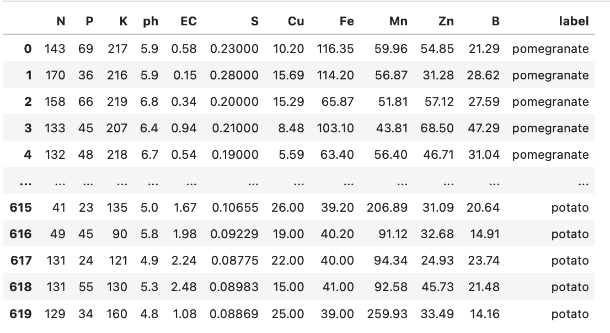
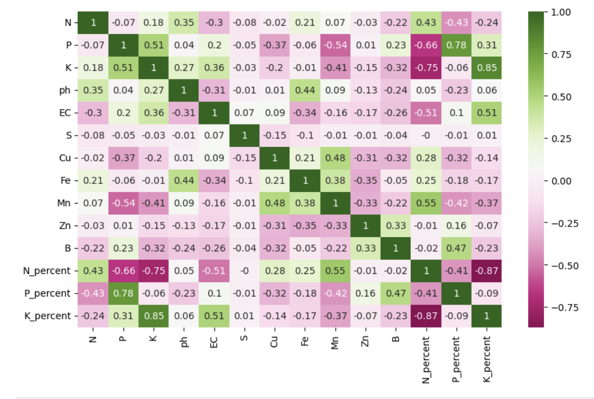
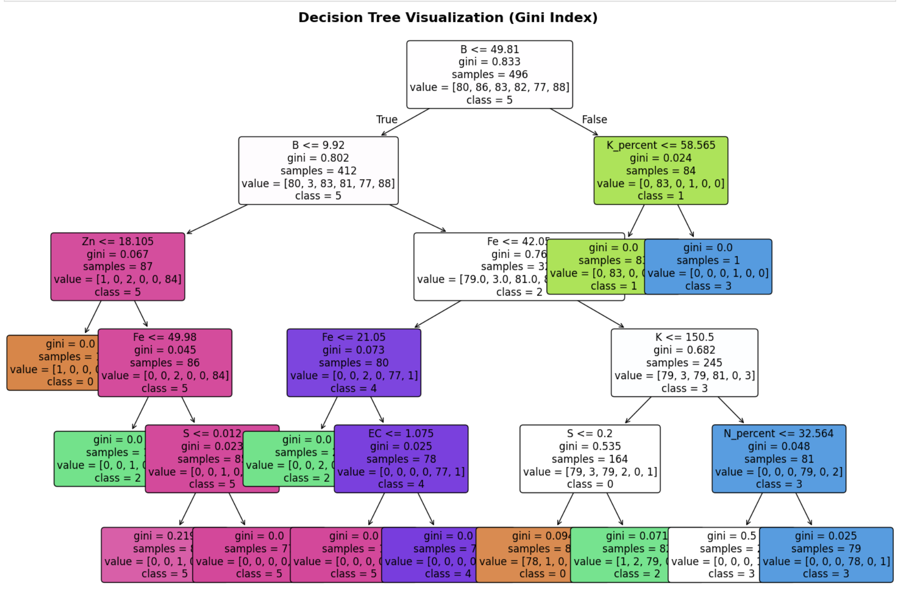
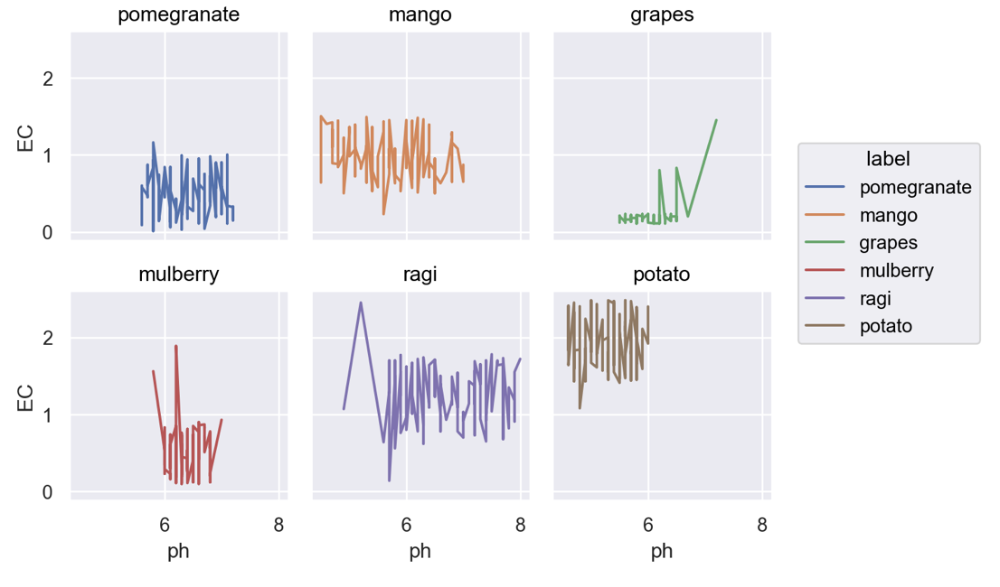
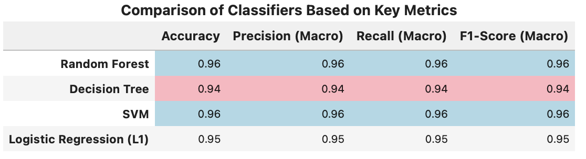
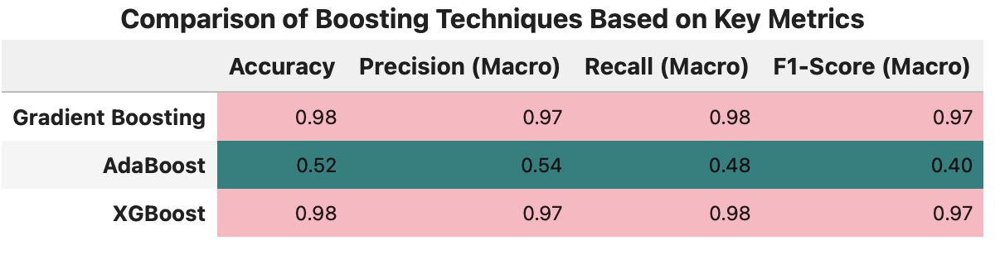
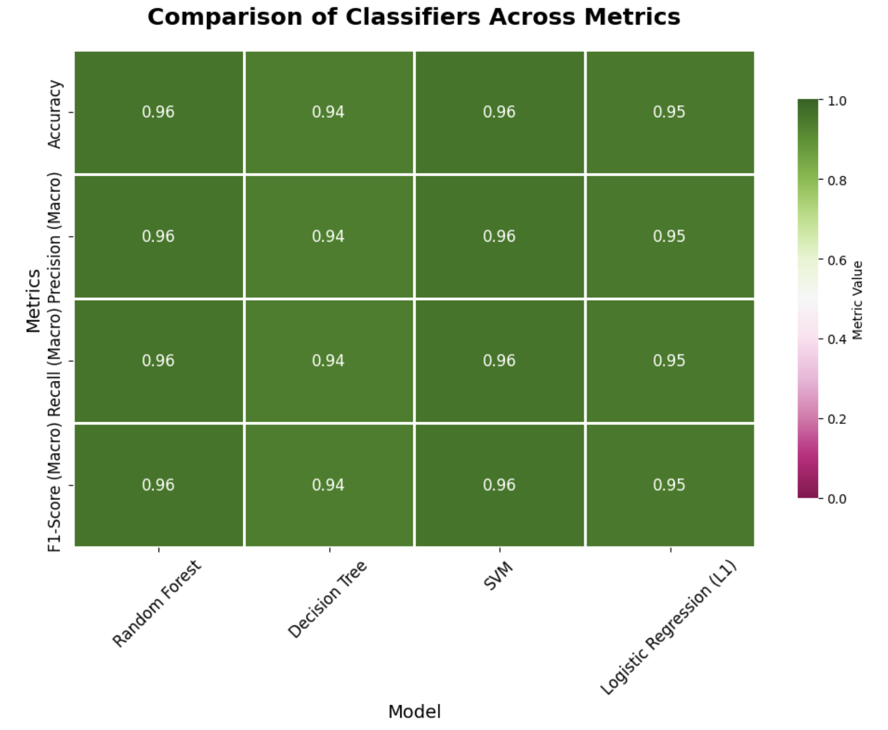
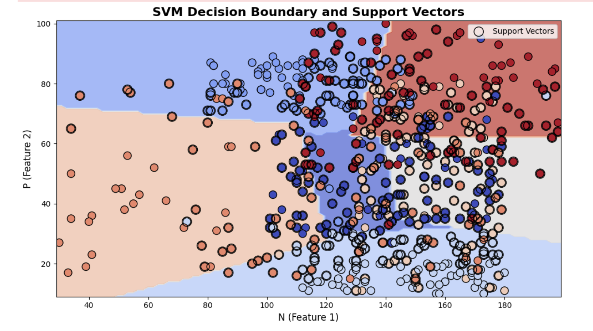

🌱 SmartSoil Crop Recommendation System
This repository contains data analysis, visualizations, and machine learning models for predicting the most suitable crop based on soil nutrient profiles.
The project leverages Python (Pandas, Matplotlib, Seaborn, Scikit-learn, XGBoost) and explores classification and boosting models for precision agriculture.

📂 Project Structure
dataset/ → Soil/crop data, downloaded from Kaggle

notebooks/ → Jupyter Notebooks for EDA, analysis, and model development

reports/ → PDF project report and presentation

README.md → Project documentation (this file)

📊 Dataset
This project uses the "Crop Recommender Dataset with Soil Nutrients" from Kaggle.
It contains measurements for various macro- and micronutrients in soil samples along with crop labels.

Columns
N – Nitrogen

P – Phosphorus

K – Potassium

pH – Soil pH

EC – Electrical Conductivity

S, Cu, Fe, Mn, Zn, B – Other essential nutrients

N_percent, P_percent, K_percent – Calculated nutrient percentages

label – Crop label (target)

Here’s a preview of the dataset:

This screenshot displays a preview of the SmartSoil Crop Recommender dataset, which consists of 12 key columns including soil macronutrients (Nitrogen, Phosphorus, Potassium), micronutrients (such as Cu, Fe, Mn, Zn, B), pH, Electrical Conductivity (EC), and crop labels. This structured view allows users to grasp the dataset's dimensionality and variable types, setting the foundation for all analysis.

I performed an extensive exploratory analysis to understand relationships among soil nutrients and crop suitability. Notable visualizations include:

📈 Feature Correlations

The correlation matrix shows the linear relationships between pairs of features. For example, Potassium (K) and K_percent are highly correlated (r=0.85), while N and P_percent have a negative correlation (r=-0.43). This insight guides feature selection, highlights potential multicollinearity, and helps explain model behavior.

This figure illustrates how a Decision Tree model splits the dataset based on soil properties to predict the most suitable crop. For instance, K_percent ≤ 58.565 is a critical rule that separates class 1 crops with high accuracy (gini=0.024, samples=84). Each node contains impurity values and sample counts, enhancing interpretability for stakeholders.

Line graphs compare the electric conductivity (EC) versus pH across six crops: pomegranate, mango, grapes, mulberry, ragi, and potato. These plots reveal that crops like grapes show increasing EC at higher pH values, while potato displays high EC across a wide pH range. Such visualization supports agronomists in identifying crop-specific soil requirements.

Classifier Comparison Table

his table summarizes the models' performance using four metrics: accuracy, precision (macro), recall (macro), and F1-score (macro). Random Forest and SVM outperform Decision Tree and Logistic Regression, both achieving 0.96 for all metrics. Decision Tree lags behind with 0.94 across metrics, while Logistic Regression scores slightly better with 0.95. These numerical comparisons assist in choosing the most robust classifier for crop prediction.

Here, Gradient Boosting and XGBoost models yield outstanding performance (accuracy=0.98, F1=0.97), exceeding AdaBoost, which only attains 0.52 accuracy and 0.40 F1-score. The near-identical values for Gradient Boosting and XGBoost demonstrate that both are highly suitable for this soil-crop classification problem, while AdaBoost is not recommended due to its lower scores.

This heatmap visualizes metric scores (ranging from 0.94 to 0.96 for most classifiers) in green color intensity. The Random Forest, SVM, and Logistic Regression cells are the darkest green, signaling maximum performance, whereas Decision Tree displays lighter green, denoting comparatively lower accuracy and precision. Heatmaps make it easy for students to grasp comparative strengths at a glance.

This plot showcases the boundary defined by the Support Vector Machine (SVM) for crop classification based on soil nutrient features. Each colored region represents a distinct crop class, and the black-circled points are support vectors. The clear separation between classes in feature space provides valuable insight into model decision-making intensity and margin geometry.

Best Models: Gradient Boosting and XGBoost were best performers in terms of accuracy, precision, recall, and F1-score.

Feature Importance: pH, N, P, K, and EC were most critical predictors.

Interpretability: Decision Trees provided clear criteria for crop recommendations.

Model Robustness: Random Forest and SVM also demonstrated high performance.

🚦 Next Steps
Try additional feature engineering or hyperparameter tuning.

Deploy the best model as a web/mobile tool for farmers.

Incorporate climate data for even better recommendations.

📎 Dataset Link
[Kaggle Crop Recommender Dataset](https://www.kaggle.com/datasets/manikantasanjayv/crop-recommender-dataset-with-soil-nutrients/data)

📚 References
Kaggle dataset and project proposal documents for full methodology and background.

